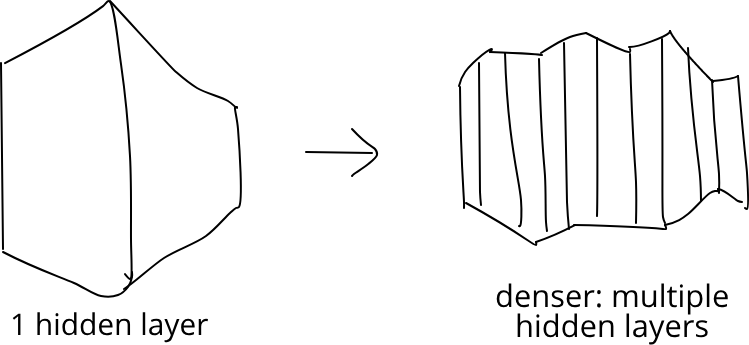
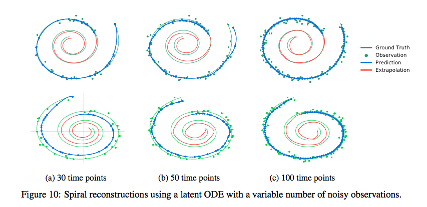

# Tunable Neural Nets

*This article discusses the award-winning paper "Neural Ordinary Differential Equations", by Ricky T. Q. Chen, Yulia Rubanova, Jesse Bettencourt and David Duvenaud, presented at NIPS 2018. Here is a [link](https://arxiv.org/abs/1806.07366).*

Deep learning has achieved amazing results in computer vision, natural language processing, and other crucial machine learning problems. State of the art algorithms reach levels of accuracy unthinkable 10 years ago, before deep learning took over. Much of this success is thanks to increasingly powerful computers which allow increasingly complex models to be trained faster. Conceptual breakthroughs play a huge part too, but more often than not, a deep learning practitioner achieves higher accuracy by throwing a more complicated model at the problem, waiting for it to train, and hoping that the end result - the trained model - will have the accuracy required. The larger a model is, the longer it takes the train, the longer it takes to predict and the more memory it uses. Most likely we have some constraints we want to respect, especially on embedded devices. These constraints limit the complexity of the model we're allowed to use. So, finding the right model is frustratingly trial-and-error, and we keep on training and testing until we find the optimal tradeoff.

What if there were a different way of going about this? What if there were a method to input our constraints, such as minimum required accuracy, memory and compute power, and then magically get delivered to our front door a neural network that's just complex enough to make the cut? A new paper presented at NIPS 2018{Neural Ordinary Differential Equations", by Ricky T. Q. Chen, Yulia Rubanova, Jesse Bettencourt and David Duvenaud} makes a big stride in this direction. It also uses a very novel and enlightening way to think of neural networks. Let's take a closer look.

## ODE Nets

When we add more intermediate layers to a neural net, we think of this as a neural net that's deeper than the original one. We could also think of it as a 'denser' neural net.



As we continue this process, we eventually get an 'infinitely dense' neural net in which values change smoothly from layer to the layer coming 'immediately after'. This is the main intuition and innovation presented in the paper: we can construct a very precise, infinitely dense neural network. An infinitely dense neural net is purely theoretical beast, as we can't do an infinite number of forward passes. However, crucially, we can *approximate* it using a finite number of layers. Depending on how accurate or fast we need our model to be, we can select a finer or coarser approximation. Moreover, we can do this systematically, instead of having to use trial-and-error, as in traditional neural networks. It sounds great - but how does it work?

We can make the intuition of an 'infinitely dense' neural network precise by using the language of calculus. A general neural network looks like this:

```
\[
h_1 = f_0(h_0, \theta_0) \\
h_2 = f_1(h_1, \theta_1) \\
\ldots
\]
```

Each hi is the next layer of our neural network, and each fi is a nonlinear function, usually a matrix multiplication followed by a non-linearity like tanh or relu. A special case of this neural network is a *residual network*{"Deep Residual Learning for Image Recognition" (2015), by Kaiming He, Xiangyu Zhang, Shaoqing Ren and Jian Sun}, which looks like this:


```
\[
h_1 = f_0(h_0, \theta_0) + h_0 \\
h_2 = f_1(h_1, \theta_1) + h_1 \\
\ldots
\]
```

[Residual networks](https://towardsdatascience.com/understanding-residual-networks-9add4b664b03) were introduced to solve a specific problem. Traditional neural nets have the disadvantage that the obvious strategy of adding layers to increase accuracy doesn't always work: eventually, test accuracy *decreases*, despite train accuracy increasing. ResNets were introduced to solve this problem.

We can rearrange the ResNet equations:

```
\begin{equation}
h_{i+1} - h_i = f(h_i, \theta_i) 
\label{eq:approxgradient}
\end{equation}
```

Mindful of our 'infinitely dense' neural network, we can think of the `\(h_i\)` as snapshots of a vector-value function `\(h(t)\)` varying continuously over time `\(t\)`. We sample it at times `\(t=0, 1, \ldots\)` to get the values at our hidden layers. Then, `\(h(t+1) - h(t)\)` is an approximation to the gradient at time `\(t\)`. Therefore, equation `\eqref{eq:approxgradient}` approximately becomes

```
\begin{equation}
\frac{dh(t)}{dt} = f(h(t), \theta_t)
\label{eq:ode-dynamics}
\end{equation}
```

given `\( h(0) = h_0 \)`.

This is an *ordinary differential equation* (ODE), and it determines the behaviour of the function `\(h(t)\)`, our 'infinitely dense' neural network. We've now made precise what it means to have an infinitely dense neural network. Apart from that though, it's still unclear what we've gained. We don't have an exact formula for `\(h\)`, only a differential equation governing its behaviour. We would like to be able to have a solution for `\(h\)`,  possibly an approximate one. Further, we would like to have fine-grained control over the error, if the solution is approximate. How can we do this?

The good news is that to solve ODEs numerically we can draw on a very big body of theory. There are many *ODE solvers*, i.e. algorithms to solve ODEs numerically. One of these is [*Euler's method*](https://en.wikipedia.org/wiki/Euler_method), which solves a differential equation `\(y'(t) = f(t, y(t))\)` by approximating the gradient with `\((y(t_{n+1}) - y(t_{n}))/h\)`, the gradient between 2 values of `\(y\)` sampled at 2 time steps. Substituting, and picking a step size `\(h\)` equal to 1, we get back equation `\eqref{eq:approxgradient}`, our ResNet equations! By using different step sizes or different ODE solvers, we get different approximations to our infinitely dense neural network. Importantly, there are modern ODE solvers which allow us to control accurately the error, the discrepancy between our computed value of `\(h\)` and the real value, as defined by the ODE. These solvers automatically adjust the step size and number of function evaluations depending on the target accuracy. The greater the desired accuracy, the greater the number of required evaluations. We receive fine-grained control over the tradeoff{see for example E. Hairer, S.P. Nørsett, and G. Wanner. Solving Ordinary Differential Equations I – Nonstiff Problems. Springer, 1987}.

## Training with less memory

How do we train our ODE net? Turns out, there's a way of doing it that requires much less memory than a traditional neural net. To train a neural network or in general any model that depends on parameters `\(\theta\)`, we use gradient descent, and compute the gradient of a loss function `\(L\)` with respect to the parameters `\(\theta\)`. This is called "backpropagation" and requires storing all *intermediate values* computed during the forward pass, and this is very memory intensive. We could use backpropagation to train our ODE net, too. To find the gradient, we could "backpropagate" through all of the operations performed by the ODE solver to compute `\(h\)` at time `\(t1\)`.

There is however an alternative to backpropagation, which is computationally much cheaper. The alternative is called the *adjoint method*. We can define the *adjoint* `\(a(t) = dL/dz(t)\)` and define `\(\lambda(t) = [a \quad dL/d\theta \quad dL/dt](t)\)`. This quantity `\(\lambda\)` obeys the following differential equation, called the *adjoint equation*:

```
\[
\frac{d\lambda}{dt} (t) = - [a \frac{\partial f}{\partial t} \quad a
\frac{\partial f}{\partial \theta} \quad a \frac{\partial f}{\partial t} ] (t)
\]
```

You can find a full derivation of the adjoint equation in Appendix B of the paper. A more comprehensive discussion of the adjoint method is beyond scope, but see [this tutorial](https://cs.stanford.edu/~ambrad/adjoint_tutorial.pdf) and papers{ 
"Fluid Control Using the Adjoint Method", Antoine McNamara, Adrien Treuille, Zoran Popovic and Jos Stam;  also
[Costate Equations](https://en.wikipedia.org/wiki/Costate_equation) and [Pontryagin's Maximum Principle](https://www.encyclopediaofmath.org/index.php/Pontryagin_maximum_principle)
}.

This equation is an ODE, and so we can solve it using any ODE solver, as with our original equation. And, just as we solved our original equation *forwards in time* starting from the initial condition `\(z(t_0) = z_0\)`, we can solve this equation *backwards in time*, as we’re given initial conditions at time `\(t=t_1\)`. At that time, `\(a(t)\)` is easy to compute, `\(dL/d\theta = 0\)` and `\(dL/dt = 0\)`, as `\(L\)` does not depend on `\(\theta\)` and `\(t\)` at time `\(t_1\)`. And, once we have `\(\lambda\)`, we in particular have `\(dL/d\theta\)` at time `\(t_0\)`. 

The analogy to traditional neural nets is clear: solving the forward ODE corresponds to a forward pass through a neural network, and solving the backward ODE corresponds to backpropagation. Crucially, in the ODE case, we can solve both equations without having to store any intermediate values. Both 'forward' and 'backward' passes only require O(1) memory instead of the O(D) memory required by traditional neural networks, or the O(D') memory required by applying backpropagation to the operations of the ODE solver. Here D is the depth and D' is the number of function evaluations made by the ODE solver, a proxy for depth.


## Results

So to summarise: using modern ODE solvers, we can approximate the output of an "ODE network" as well as its gradient to an arbitrary degree of precision, at the cost of extra compute but not extra memory, which is always O(1).

This is very useful. For example, we can train such a model to a high degree of accuracy but then use a coarser, lower precision approximation at test time, when we have speed constraints. This is not magic, because we can only expect our approximations to be as good as the hypothetical infinitely dense ODE network. There is no guarantee that the ODE network reaches perfect accuracy. In fact, it almost certainly won't be able to, because all data is noisy! So the question is, how good can our results actually get with such a model, and at what compute and memory cost?

The authors of the paper compare a traditional ResNet to an ODE Net on the MNIST digit classification challenge. The ResNet is a neural net that downsamples the input twice (2 layers), followed by 6 residual blocks. The ODE Net replaces the residual blocks with an ODE module. The function f used to determine the dynamics of the ODE net is itself a neural net. Both the ResNet and the ODE Net achieve a similar error of about 0.4%, but the ODE Net can make do with fewer parameters: about 220,000 versus 600,000 for the ResNet. And as mentioned the ODE Net requires less memory. 

An intuitive explanation for the fact that we require fewer parameters is that in our infinitely dense hypothetical ODE network, we constrain our intermediate layers `\(h(t)\)` to vary smoothly as a function of `\(t\)`: neighbouring layers are "tied together". This constraint is implicit in the fact that we expect a smooth solution to our differential equation. However, with a normal neural network, there is no such constraint, and in principle `\(h\)` could vary widely between layers.

The authors also experiment whether or not there is a correlation between computational cost and precision, which turns out to be the case. A further unexpected result is that the number of function evaluations for the "backward pass" needed to compute the gradients seems to be about half of the number of function evaluations required to do the forward pass. This suggests that the ODE method is not only more memory efficient, but also more more computationally efficient.


## Time series data

Having a continuous, "infinitely dense" neural network is very useful for time series data. Often we have time series data that's sampled at irregular time intervals. Applying traditional RNNs to time series data requires discretizing it in some way, but if the data is sampled at very irregular intervals, it's not obvious how to do this. However, with ODE networks, it's very natural to deal with irregular time series data, because they are not just defined at discrete times `\(0, 1, \ldots\)` but over a continuous time range from `\(t_0\)` to `\(t_1\)`.

How exactly is this done? We could naively model the time series as an ODE net directly. The values of the time series would be the values `\(h(t_0), h(t_1), \ldots h(t_n)\)`  taken by the ODE net. This is usually not enough as the solution to our ODE, `\(h(t)\)`, is too simple to model complicated time series behaviour. A technique to make a simple function `\(h(t)\)` act in a more complicated way is to transform the output `\(h(t)\)` using some other function `\(g\)`. We can then write `\(x(t) = g(h(t))\)`, and say that our time series `\(x(t)\)` is governed by a *latent trajectory* `\(h(t)\)` which is the solution to the ODE net.

Generalising a little we can say that our data `\(X\)` depends on a latent variable `\(z\)`. To generate a sample for `\(x\)`, we first generate a sample for `\(z\)`, and assume given a prior distribution for `\(z\)`: `\(p(z)\)`. Then, using `\(z\)`, we can generate `\(x\)`, and assume we are given a conditional distribution `\(p(x|z)\)`. We restrict `\(p(x|z)\)` and `\(p(z)\)` to belong to a family of distributions depending on parameters `\(\theta\)`: `\(p_\theta(x|z)\)` and `\(p_\theta(z)\)`, and our goal is to learn the most likely value of `\(\theta\)` given the data `\(X\)` we observe. The variable `\(z\)` is called the *latent variable*. We don’t ever observe it, but it governs our observed data. For example, the amount of rainfall for a particular day governs how many umbrellas are sold at a particular shop. In this case, `\(x\)` is the number of umbrellas sold and `\(z\)` is the mm of rainfall. Our sales assistant at this shop, which we assume to be indoors and have no windows, observes only `\(x\)`, not `\(z\)`.

In our case 

- each `\(x\)` is a whole time series, which we observe at discrete time points `\(t_0, t_1, \ldots t_n\)`;
`\(z\)` corresponds to a particular value of `\(h(t_0)\)`, which determines a unique *latent trajectory* - a unique solution to the ODE
- given `\(z\)`, the value of `\(x\)` at times `\(t_0, t_1, \ldots t_n\)` are governed by a particular `\(p(\{x(t_i)\} | \{z(t_i)\}, \theta_x) = \prod_i p(x(t_i) | z(t_i), \theta_x)\)`

Or, in equations

```
\[
z = h(t_0) \sim p(h(t_0)) \\
z_{t_1}, z_{t_2}, \ldots z_{t_n} = \text{ODESolve}(z_{t_0}, f, \theta_f, t_1, t_2,
\ldots)  \\
x_{t_i}  \sim  p(x_{t_i} | z_{t_i}, \theta_x)
\]
```

Now again: given a choice for a parameterised family of distributions `\(p(h_{t_0})\)`, `\(f_{\theta_f}\)` and `\(p_{\theta_x}(x_{t_i} | z_{t_i})\)`, we would like to find `\(\theta\)`, in order to understand how the data is generated. We would also like to find out the posterior `\(p_\theta(z|x)\)`, so that, given time series data `\(x\)` that we observe, we can 

- find/generate the corresponding most likely latent trajectory `\(z\)`
- use the latent trajectory to infer `\(h_{t_0}, h_{t_1}, \ldots h_{t_n}\)` and further to extrapolate the value of the latent trajectory at later times, `\(h_{t_{n+1}}, h_{t_{n+2}}, \ldots \)`
- we can then use `\(h_{t_{n+1}}, h_{t_{n+2}}, \ldots\)` to generate `\(x_{t_{n+1}}, x_{t_{n+2}}, \ldots\)` i.e. extrapolate later points in the time series.

Back in the general setting, we have `\(p_\theta(x|z)\)` and `\(p(z)\)`; we would like to infer the most likely value of `\(\theta\)`, given the observed data, and the posterior `\(p_\theta(z|x)\)`. Problems of this sort can be solved using a *auto-encoding variational Bayesian* (AEVB) algorithm{ Diederik P. Kingma and Max Welling. Auto-encoding variational Bayes. International Conference on Learning Representations, 2014. }. The idea of AEVB is that it is difficult to compute `\(p_\theta(z|x)\)` directly, as this involves computing or approximating a difficult integral, a problem that’s computationally too demanding. Instead, AEVB works by approximating the posterior `\(p(z|x)\)` with a *recognition model* `\(q_\phi(z|x)\)`. Here `\(q_\phi\)` is again a family of distributions, parameterised by `\(\phi\)`. It's an approximation to the real posterior `\(p_\theta(z|x)\)`. We can think of `\(p_\theta(x|z)\)` as a *decoder* that takes a latent variable and spits out an observed value, and `\(q_\phi(z|x)\)` as an *encoder* that takes an observed value and gives the corresponding encoded latent value.

The AEVB algorithm jointly learns the parameters `\(\theta\)` and `\(\phi\)` by maximising a similarity function that measures the similarity between the real posterior `\(p_\theta(z|x)\)` and its approximation `\(q_\phi(z|x)\)`. The similarity function is called the evidence lower bound (ELBO), and is a proxy for the Kullback-Leibler divergence between the two distributions{ here is a [tutorial](http://edwardlib.org/tutorials/klqp) }. AEVB can efficiently learn these two parameters, provided we restrict `\(q_\phi\)` to distributions that can be written as `\(q_\phi(z|x) = g(x, \epsilon)\)` where `\(g\)` is a smooth, deterministic function of `\(x\)` and `\(\epsilon \sim p(\epsilon)\)` is an auxiliary noise variable. For details, see Kingma and Welling{ Diederik P. Kingma and Max Welling. Auto-encoding variational Bayes. International Conference on Learning Representations, 2014. }. 

In our case, these conditions hold. We can choose the recognition model to be a gaussian `\(N(\mu, \sigma) = \mu + \sigma N(0,1)\)`, where `\(\mu\)` and `\(\sigma\)` are learnt from the data. Specifically, they are learnt from an RNN that traverses the observed data points backwards in time. When the recognition model is a neural net, we call this model a *variational autoencoder*. We choose `\(p(h_{t_0})\)` to be Gaussian `\(N(0,1)\)`, the function `\(f\)` determining our latent space to be a neural net, and `\(p(x_{t_i}|z_{t_i})\)` also to be a different neural net. 

In the paper they apply this method to synthetic spiral data, and get some very nice looking results indeed.





Another application of ODE nets mentioned in the paper concerns normalizing flows. I won’t cover that here, but encourage you to take a look!


## Conclusion


We looked at ODE nets, an “infinitely dense” neural network. These models are in many ways like neural nets, and we can think of neural nets as approximations to ODE nets. The additional structure of ODE nets makes them more efficient than neural nets. We can achieve similar levels of accuracy with a third of the number of parameters as a traditional neural net. Training an ODE net requires only O(1) memory, as opposed to a neural net which requires O(L) memory, where L is the number of layers. We have much better control over the accuracy-performance tradeoff with ODE nets. For example, we can switch to a lower-accuracy but faster ODE net at test time, when speed is crucial. The fact that ODE nets take on values over a continuous time range make them a very effective way to model the latent state of a time series model.

To date, neural nets are still a black box. They work, but it’s unclear why. At the surface level, they’re a convenient way to modularly build very complicated, non-linear functions with millions of parameters that can be efficiently trained. Training them might require some tricks, but these tricks are increasingly well-known and part of deep learning frameworks. But at a deeper level, we don’t know how or why certain features are selected. We don’t know what they mean, or how to intentionally select them or ignore them. ODE nets shed some light on neural nets, as well as bringing obvious computational benefits and generality. 

I'm hoping that more work like this will shed further light on how neural nets work. We want to understand why certain features are selected during training. We'd ideally like much improved privacy, security and AI ethics. A proper understanding of why neural nets make certain decisions will have a lasting impact on both the reach and ethics of deep learning. 


